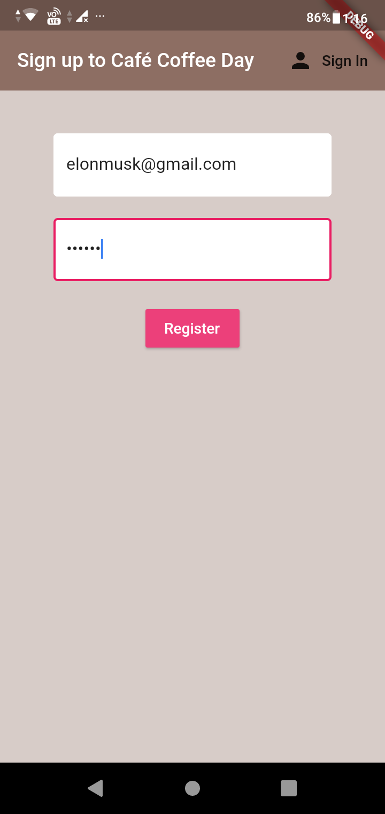
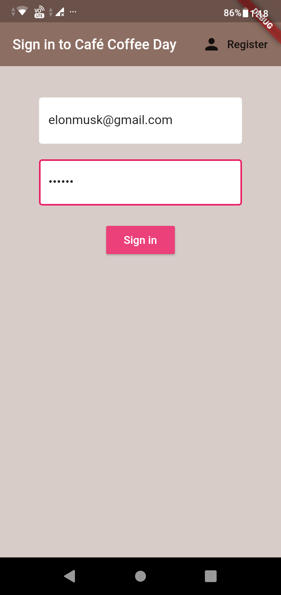
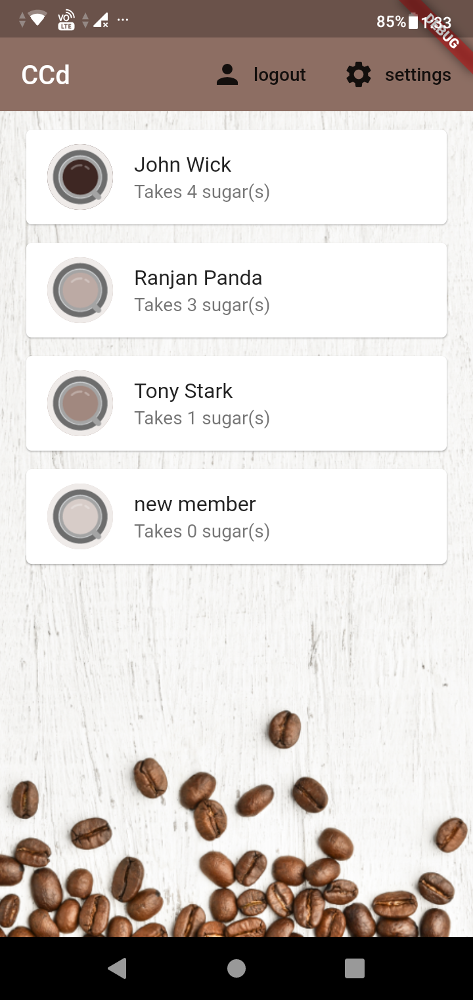
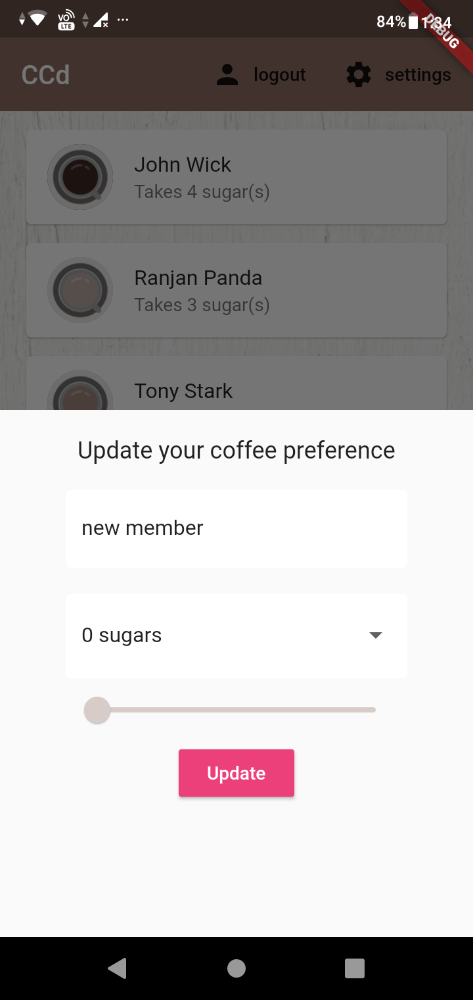
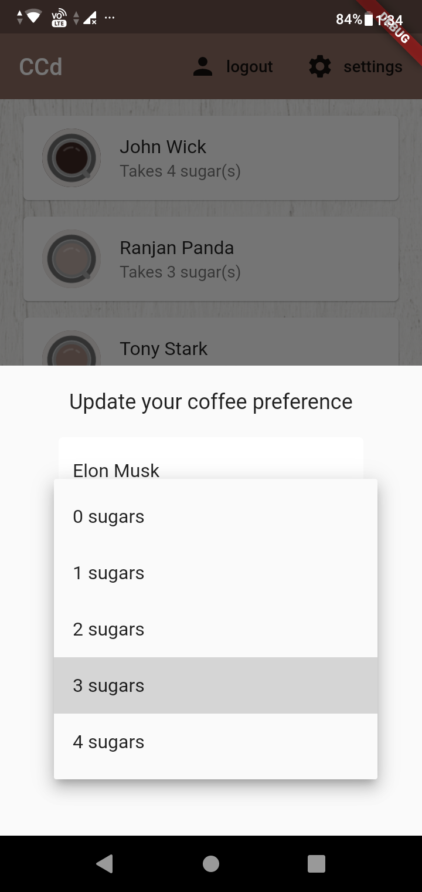
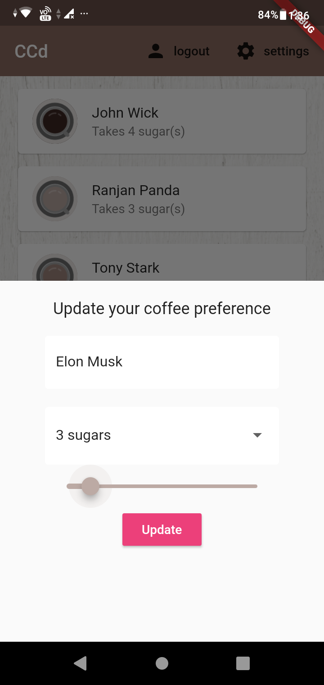
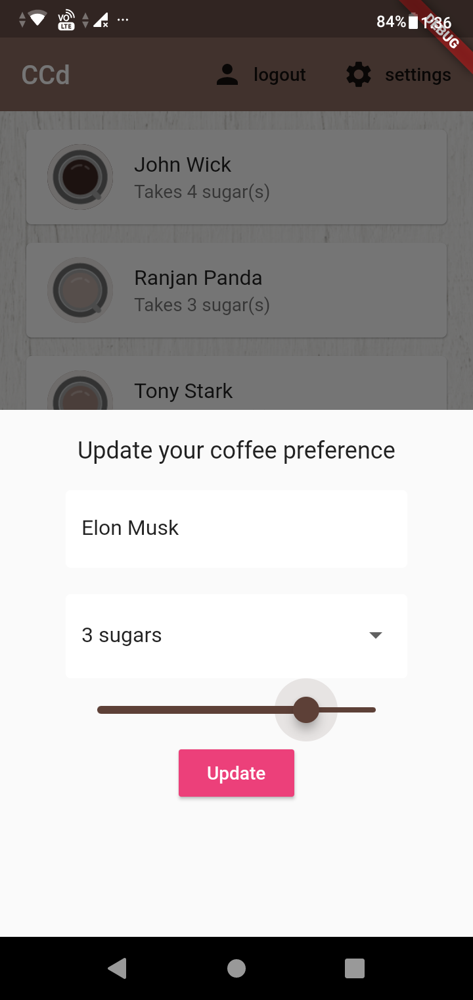
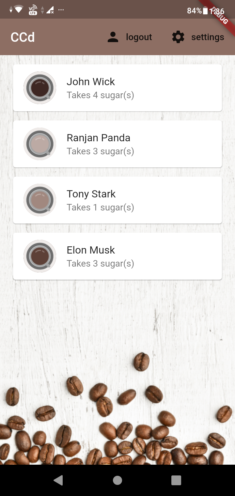
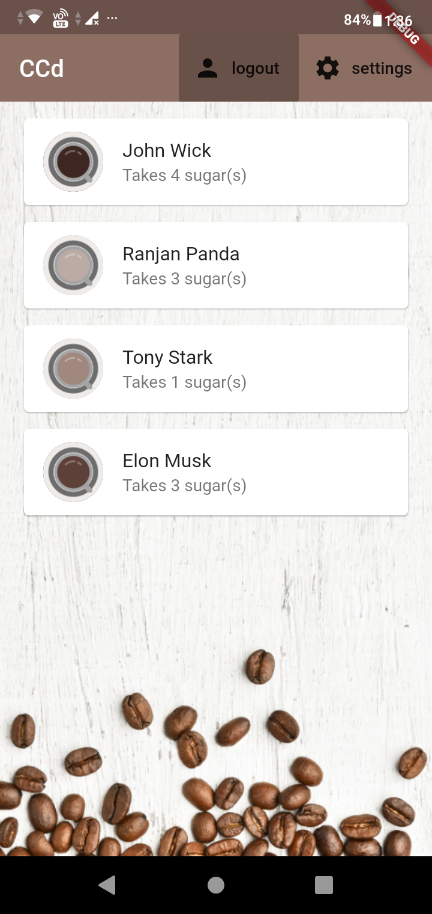

# Cafe Coffee Day Application
Flutter made application with firebase authentication which simplifies the task to take orders and removes the possibility of incorrect orders.

### Sign up for the first time or sign in if you already have an account
&nbsp;&nbsp;&nbsp;&nbsp; 

### After logging in it redirects to the home page which shows you your peer's coffee preference. For the first time, your preference is set to defaults.

### Update your coffee preference, by clicking on the settings button

### Change your name and the amount of sugar to be added

### Slide your way to choose the darkness of your coffee. The color of your coffee appears in real time, lighter to the left and darker to the right
&nbsp;&nbsp;&nbsp;&nbsp; 

### Click 'Update' to set your preference and see the changes in home page

### Logout to return to the sign in page

